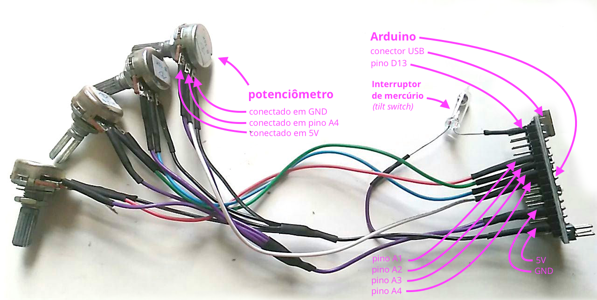

----

# Lousa mágica & Lousa paramétrica

Ferramentas de desenhar com potenciômetros ([veja o repositório no GitHub!](https://github.com/villares/lousa-magica/))

> 
>  Vídeo da Lousa mágina no Sesc 24 de maio - crédito: [João Adriano Freitas](https://github.com/jaafreitas)

#### Breve histórico

* A *Lousa mágica* foi apresentada inicialmente pelo [Estúdio Hacker](http://estudiohacker.io) na inauguração do Sesc 24 de Maio, em agosto de 2017 (vídeo acima), com 6 potenciômetros, permitia desenhar e apagar o desenho tombando a caixa de controle. Também era possível (por conta de uma biblioteca) postar *tweets* com o desenho.
* No Estúdio Hacker Day em 7 de setembro de 2017, também no Sesc 24 de maio, foi realizada atividade em que os participantes montavam uma versão da *Lousa mágica* com 4 potenciômetros em uma protoboard.
* Para o Circuito Sesc de Artes 2018 foram feitas montagens com 4 potenciômetros com uma variante do software da *Lousa mágica* e uma versão nova chamada *Lousa paramétrica* com um desenho paramétrico recursivo de uma árvore.
* Diversos desenhos do projeto [*sketch-a-day*](https://villares.github.com/sketch-a-day) podem ser usados com a mesma montagem.
* `TO DO: links de outros desenhos 'ajustáveis'`

#### Lista de materiais

* Arduino (ou variante) com pelo menos 4 portas analógicas;
* Cabo USB para ligar o Arduino ao computador;
* 4 a 6 potenciômetros lineares (tipo "B") de 10kΩ (com 2 ou 3 dá mas tem menos graça);
* Protoboard e jumpers;
* Computador com monitor (ou laptop) Linux, Mac ou Windows. Para impressionar as visitas use uma TV grande ou um projetor.
* Opcional: Botão instantâneo ou interruptor de mercúrio (pode ser usado apenas o teclado do computador) e resistor 10kΩ (caso seja usado um botão/interruptor conectado a um pino diferente do `D13`);

#### Instruções de montagem

1. Baixe e instale o IDE do [Arduino](http://arduino.cc) e o IDE do [Processing](http://processing.org);

2. Conecte o seu Arduino/placa ao computador, abra o Arduino IDE, localize e abra pelo menu `File > Examples > Firmata` o *sketch* chamado **Firmata All Inputs**, em seguida selecione no menu `Tools > Board:` o modelo da sua placa, e em `Tools > Port` a porta USB/serial em que a placa está conectada ao computador. Por fim use o botão `➔` para fazer o *upload* do *sketch* para a placa.;

3. Abra o Processing IDE e pelo menu `Sketch > Import Library... > Add Library...` baixe e instale a biblioteca **Arduino (Firmata)**. Sugerimos também que você instale o **modo Python** pelo menu de seleção de modos no canto superior direito do IDE, que inicialmente marca `Java` ([instruções detalhadas](https://github.com/villares/villares.github.io/blob/master/como-instalar-o-processing-modo-python/index.md));

4. Faça a conexão dos potenciômetros ao seu Arduino/placa conforme a imagem:

   4.1 Conecte os terminais laterias de cada potenciômetro aos pinos `5V` e `GND`,
   4.2 Conecte os terminais centrais deles aos pinos analógicos do Arduino: `A1`, `A2`, `A3` e `A4`;

5. Opcionalmente, se for usar um interruptor (ou botão) para apagar o desenho da *Lousa mágica*, este deve ter um terminal conectado ao pino `Digital 13` e o outro à alimentação `5V`;
> Se não for usar o pino `D13`,  conecte simultaneamente o terminal do pino escolhido ao resistor de 10kΩ (é o chamado resistor  *pull-down*, e deve então ser conectado ao `GND`). O pino `D13` já tem um *pull-down* embutido

6. Copie o código [`LousaMagica.pyde`](LousaMagica/LousaMagica.pyde) deste repositório e altere o número da porta serial/USB adequadamente (procure testar usando os números das portas que aparecem no console do Processing);

7. Explore as outras versões no repositório  [`github.com/villares/lousa-magica`](https://github.com/villares/lousa-magica/):

  * *Lousa mágica*: 
    - [versão com apenas 2 potenciômetros](https://github.com/villares/tree/master/lousa-magica/LousaMagica2pots)
    - [versão em Processing Modo Java](https://github.com/villares/lousa-magica/tree/master/LousaMagica_java)
    - [versão Circuito Sesc de Artes 2018](https://github.com/villares/lousa-magica/tree/master//lousa_magica_versao_circuito_sesc)

  * *Lousa paramétrica*:  
    - [*Árvore recursiva* (Circuito Sesc de Artes 2018)](https://github.com/villares/lousa-magica/tree/master/lousa_parametrica_arvore_circuito_sesc)
    - [*Grafos*](https://github.com/villares/lousa-magica/tree/master/lousa_parametrica_grafos)
    - [*Polígonos recursivos*](https://github.com/villares/lousa-magica/tree/master/lousa_parametrica_poligonos_recursivos)
    - Procure mais *sketches* no repositório [`villares.github.com/sketch-a-day`](https://villares.github.com/sketch-a-day)

#### Exemplo de montagem com Arduino Nano

#### Suguestões para uma montagem definitiva

* Ferramentas: Alicate e solda;
* Use um interruptor de mercúrio no `D13` em lugar do botão para apagar o desenho da *Lousa mágica*.
* Monte em uma caixinha com frente transparente, faça furos para os potenciômetros.

#### Mais ideias

* Pong com potenciômetros, versão Dojo: [`github.com/arteprog/cursos/tree/master/DOJO-pong-com-pot`](https://github.com/arteprog/cursos/tree/master/DOJO-pong-com-pot)

* Versão "sem fio" feita pelo [João Adriano Freitas](https://github.com/jaafreitas): [`github.com/jaafreitas/LousaMagica`](https://github.com/jaafreitas/LousaMagica)

----

Alexandre B A Villares ([abav.lugaralgum.com](https://abav.lugaralgum.com)), [CC-BY-NC-SA-4.0 License](https://creativecommons.org/licenses/by-nc-sa/4.0/)
